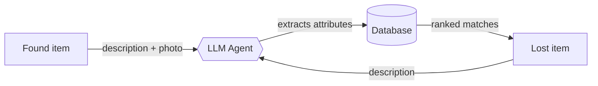

# 🔍 DCU Lost & Found Agent

An LLM-based agent that helps DCU students find their stuff — built for CSC1202.

## What it does

- **Found something?** Describe it + upload a photo — the agent extracts object, colour, brand, location and features automatically.
- **Lost something?** Describe it in your own words — the agent semantically matches it against everything logged as found.

## Stack

Django · MySQL · LLM API (TBD) · Bootstrap or React (TBD)

## Team

| Name | Role |
|---|---|
| Alexander Zudins | |
| Cameron Servitillo | |
| Tawana Gumede | |
| Muhammad Muhammad Arfhan | |
| Nelson Cololo Onodugo | |
| Uvidu Vihan DeSilva | |

## Docs

- [`docs/deliverables/`](docs/deliverables/) — the three assessed reports
- [`docs/meeting-notes/`](docs/meeting-notes/) — meeting reports

---
CSC1202 · Prompt Engineering and LLM-Based Agents · DCU 2026
